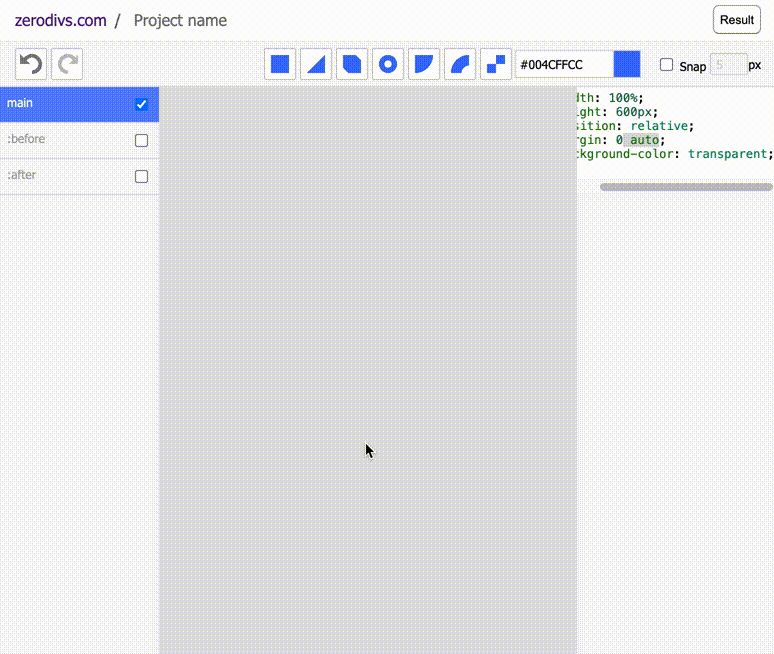

# ZeroDivs

UI Editor for CSS Illustrations.

Saves to [localStorage](https://developer.mozilla.org/en-US/docs/Web/API/Window/localStorage) and exports to [CodePen](https://codepen.io/).

Live app: https://zerodivs.com

More information: https://perals.io/projects/zerodivs/



# Basic usage

The app follows usual UI/UX patterns for vector graphics drawing tools, such as drag-and-drop, layers, or color picking. Zooming is done by scrolling with the trackpad or mouse. The following keyboard shortucts can also be used:

| Key | Function |
| - | - |
| a | Select all shapes |
| d | Duplicate shapes |
| Shift | Keep pressed to select multiple shapes |
| Esc | Unselect shapes |
| Backspace | Remove shapes |
| Delete | Remove shapes |
| Arrow keys | Move shapes by 1px |
| Meta+c | Copy shapes |
| Meta+x | Cut shapes |
| Meta+v | Paste shapes |
| Meta+z | Undo |
| Meta+Shift+z | Redo |

## Local project setup
```
npm install
```

### Compiles and hot-reloads for development
```
npm run serve
```

### Compiles and minifies for production
```
npm run build
```

### Run your unit tests
```
npm run test:unit
```

### Lints and fixes files
```
npm run lint
```

### Customize configuration
See [Configuration Reference](https://cli.vuejs.org/config/).
